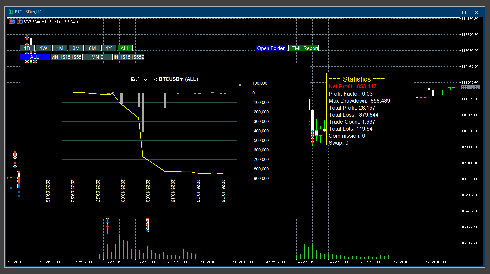

# ProfitChart Graphic Indicator

A comprehensive profit/loss chart indicator for MetaTrader 5 (MT5) and MetaTrader 4 (MT4) with HTML export functionality and detailed trade statistics.



## Features

### Visual Chart Display
- **Cumulative P/L Line Chart**: Yellow line showing your total profit/loss progression over time
- **Individual Trade Bars**: Dark gray histogram showing profit/loss for each trade
- **Time-based Aggregation**: Automatically aggregates trades based on selected period for cleaner visualization
- **Dark Theme**: Professional black background with white text and yellow accent

### Period Filters
Filter your trading history by time period:
- **1D**: Last 24 hours (1-hour aggregation)
- **1W**: Last 7 days (4-hour aggregation)
- **1M**: Last 30 days (daily aggregation)
- **3M**: Last 90 days (daily aggregation)
- **6M**: Last 180 days (daily aggregation)
- **12M**: Last 365 days (daily aggregation)
- **ALL**: Complete trading history (daily aggregation)

### Magic Number Filter
- Filter trades by specific Expert Advisor magic number
- View all trades across all EAs (magic number -1)
- Quick toggle buttons for common magic numbers (0, 100, 200, etc.)

### Statistics Panel
Comprehensive trading metrics displayed on the chart:
- **Profit Factor (PF)**: Ratio of gross profit to gross loss
- **Max Drawdown (DD)**: Maximum peak-to-trough decline
- **Total Lots**: Sum of all trade volumes
- **Trade Count**: Number of closed trades
- **Total Profit**: Sum of all winning trades
- **Total Loss**: Sum of all losing trades
- **Net Profit**: Total profit minus total loss
- **Total Commission**: Sum of all broker commissions
- **Total Swap**: Sum of all swap charges

### HTML Export
Generate professional HTML reports with interactive charts:
- **Automatic Browser Opening**: Reports open automatically in your default browser
- **Interactive Charts**: Powered by Chart.js with zoom and pan capabilities
- **Responsive Layout**: Optimized for screenshots (1600px width)
- **Trade History Table**: Complete list of all trades with details
- **Date Range Display**: Shows exact period covered by the report
- **Open Folder Button**: Quick access to the Reports directory

### Cashback Calculation
- Optional cashback tracking per 0.01 lot
- Toggle cashback display on/off
- Includes cashback in cumulative calculations when enabled

## Installation

### For MT5:
1. Copy all files to your MT5 data folder:
   ```
   [MT5 Data Folder]/MQL5/Indicators/ProfitChart_Graphic_Indicator/
   ```
2. Files required:
   - `ProfitChart_Graphic_Indicator.mq5`
   - `ProfitChart_Common.mqh`
   - `ProfitChart_Graphic.mqh`
   - `ProfitChart_HistoryLoader.mqh`
   - `Graphic.mqh` (MT5 standard library)

3. Compile the indicator in MetaEditor or restart MT5 to auto-compile
4. Attach to any chart from the Navigator window

### For MT4:
1. Copy all files to your MT4 data folder:
   ```
   [MT4 Data Folder]/MQL4/Indicators/ProfitChart_Graphic_Indicator/
   ```
2. Files required:
   - `ProfitChart_Graphic_Indicator.mq4`
   - `ProfitChart_Common.mqh`
   - `ProfitChart_Graphic.mqh`
   - `ProfitChart_HistoryLoader.mqh`
   - `ProfitChart_Canvas_MT4.mqh`

3. Compile the indicator in MetaEditor or restart MT4 to auto-compile
4. Attach to any chart from the Navigator window

## Usage

### Input Parameters

| Parameter | Default | Description |
|-----------|---------|-------------|
| `InpSymbol` | Current symbol | Symbol to analyze (e.g., "BTCUSDm", "EURUSD") |
| `InpMagicNumber` | -1 | Magic number filter (-1 = all trades) |
| `InpCashbackPer001Lot` | 0.0 | Cashback amount per 0.01 lot |
| `InpChartX` | 10 | Chart horizontal position (pixels) |
| `InpChartY` | 180 | Chart vertical position (pixels) |
| `InpChartWidth` | 1200 | Chart width (pixels) |
| `InpChartHeight` | 600 | Chart height (pixels) |

### Control Buttons

**Period Selection (Top Row):**
- Click any period button (1D, 1W, 1M, 3M, 6M, 12M, ALL) to filter date range
- Current selection is highlighted

**Magic Number Selection (Second Row):**
- Click magic number buttons to filter by specific EA
- "ALL" button shows trades from all magic numbers
- "+CB" button toggles cashback inclusion

**Export Buttons:**
- **HTML**: Generate and open HTML report in browser
- **Open Folder**: Open the Reports directory in File Explorer

### HTML Reports

HTML reports are automatically saved to:
```
[Terminal Data Folder]/MQL5/Files/Reports/
```

Report filename format:
```
ProfitReport_[SYMBOL]_MN[MAGIC]_[TIMESTAMP].html
```

Example: `ProfitReport_BTCUSDm_MN-1_2025.10.26_00.04.09.html`

### Tips for Best Results

1. **For Screenshot Optimization**:
   - Reports are designed at 1600px width for high-quality screenshots
   - Statistics are arranged in a 3-column grid for compact display

2. **Short-term Analysis**:
   - Use 1D or 1W periods to see hourly/4-hour detail
   - Trade timestamps shown in tooltips

3. **Long-term Analysis**:
   - Use 3M, 6M, 12M, or ALL for overview
   - Daily aggregation reduces noise

4. **Multi-EA Accounts**:
   - Use magic number filters to analyze each EA separately
   - Compare performance across different strategies

## Technical Specifications

- **Platform**: MetaTrader 5 / MetaTrader 4
- **Language**: MQL5 / MQL4
- **Charting Library (MT5)**: CGraphic (Standard Library)
- **Charting Library (MT4)**: Custom Canvas implementation
- **HTML Charts**: Chart.js v3.9.1
- **File Operations**: MQL5 File API
- **Windows Integration**: Shell32.dll for browser/folder opening

## File Structure

```
ProfitChart_Graphic_Indicator/
├── ProfitChart_Graphic_Indicator.mq5     # Main MT5 indicator
├── ProfitChart_Graphic_Indicator.mq4     # Main MT4 indicator
├── ProfitChart_Common.mqh                # Shared data structures & utilities
├── ProfitChart_Graphic.mqh               # Chart rendering logic
├── ProfitChart_HistoryLoader.mqh         # Trade history loader
├── ProfitChart_Canvas_MT4.mqh            # MT4 canvas implementation
└── README.md                             # This file
```

## Statistics Explained

### Profit Factor (PF)
```
PF = Total Profit / Total Loss
```
- Values > 1.0 indicate profitable trading
- Values < 1.0 indicate losing trading
- Example: PF = 2.0 means you earn $2 for every $1 lost

### Max Drawdown (DD)
The largest peak-to-trough decline in cumulative profit:
```
DD = Peak Cumulative Profit - Lowest Subsequent Value
```
- Measures risk exposure
- Lower values indicate more stable equity curve

### Net Profit
```
Net Profit = Total Profit - Total Loss
```
- Your actual profit/loss after all trades
- Includes commission and swap charges

## Compatibility

- **MT5**: Fully supported (build 3400+)
- **MT4**: Fully supported (build 1220+)
- **Windows**: Required (uses ShellExecuteW for HTML opening)
- **Browsers**: Any modern browser (Chrome, Firefox, Edge, Safari)

## Version History

### v1.0.0 (2025-10-26)
- Initial release
- MT5 and MT4 support
- Period-based filtering (1D to ALL)
- Magic number filtering
- HTML export with Chart.js integration
- Automatic browser opening
- Statistics panel with 9 metrics
- Cashback calculation
- Time-based trade aggregation
- Dark theme design
- Folder access button

## Credits

- **Chart Library (MT5)**: MQL5 Standard Library `Graphic.mqh`
- **HTML Charts**: Chart.js (https://www.chartjs.org/)
- **Development**: Luke H.
- **License**: Copyright 2025

## Support

For issues, questions, or feature requests, please contact the developer or refer to the MQL5/MQL4 documentation:
- MT5 Documentation: https://www.mql5.com/en/docs
- MT4 Documentation: https://docs.mql4.com/

---

**Generated with Claude Code** (https://claude.com/claude-code)

Co-Authored-By: Claude <noreply@anthropic.com>
